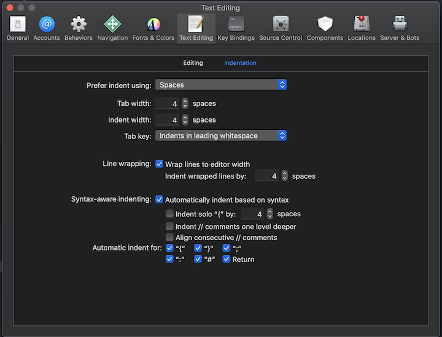

# Contributing to the Coordinator Pattern.

The coordinator pattern evolves with the Swift language. It might look different from patterns, but the focus is centered on readability and pragmatic solution. I created this repository to harness everything that is new in `Swift` and learn day after day.

We appreciate and encourage contributions from the community that improve this pattern and hence also improve the quality of our production codebase in our various companies. This document outlines the process for making contributions to the guide.

**Note:** You are responsible for adding your name to the list of contributors should you desire.

## Fixing Typos

Uncontroversial, non-additive changes such as misspellings, grammar or compiler errors can be fixed by simply issuing a pull request to master. The maintainer will merge the pull request or, if it is deemed "controversial" request the contributor open an issue so that other members of the community can participate in the discussion.

## Style Changes 

Authors are expected to follow all of the rules in the [Raywenderlich style guide](https://github.com/raywenderlich/swift-style-guide) unless special circumstances or exceptions apply.  Because of this, it is important that updates happen at predictable times.  Be aware in advance that there may be a significant delay (many months) before a suggestion is ratified on the master branch.

**Style guide exception**
The only exception related to the  [Raywenderlich style guide](https://github.com/raywenderlich/swift-style-guide) is that on this project we will be making use of 4 space tab indentation as shown in the image below: 

### Step 1: Open an Issue

Open an issue on github and describe the changes you would like to make, reasons, and motivation based facts.

### Step 2: Wait for Community Feedback

Wait for feedback on the issue. Even if the feedback is negative, don't close the issue too quickly.  Often times the discussion itself can be useful and give way to something even better.  Patterns are very subjective and it is important to always be respectful.  We expect participants to follow the same community guidelines as the Swift project itself outlined at [contributor-covenant.org](http://contributor-covenant.org)

### Step 3: Wait for Maintainer/Reviewer Go Ahead

The maintainer will decide if a change is go or no go.  This decision is not necessarily based on the feedback of the community, but will often play a role. If you believe that the maintainer is mistaken, you can appeal the decision by just asking them.  Apologies in advance if your suggestion isn't accepted.  You are always welcome, however, to make your own pattern for your organization or community! 

### Step 4: Create a Pull Request on the Update branch

Given the go ahead from the maintainer, create a pull request on the update branch in the repo.  There should be one of these.  If it is not clear what it is, ask the maintainer.  The current development branch is `develop.`

## Step 5: Branch Merged

At this point your involvement is complete. The maintainer will merge your PR to the develop branch.

## Step 6: Update Branch Reviewed

The `Senior Maintainer`  has a chance to look at the final updated pattern before it is merged to master.  If an objection is raised, as with the appeal process, team will deliberate on the final decision.

## Step 7: Develop Branch Merged to Master

Hurray!
